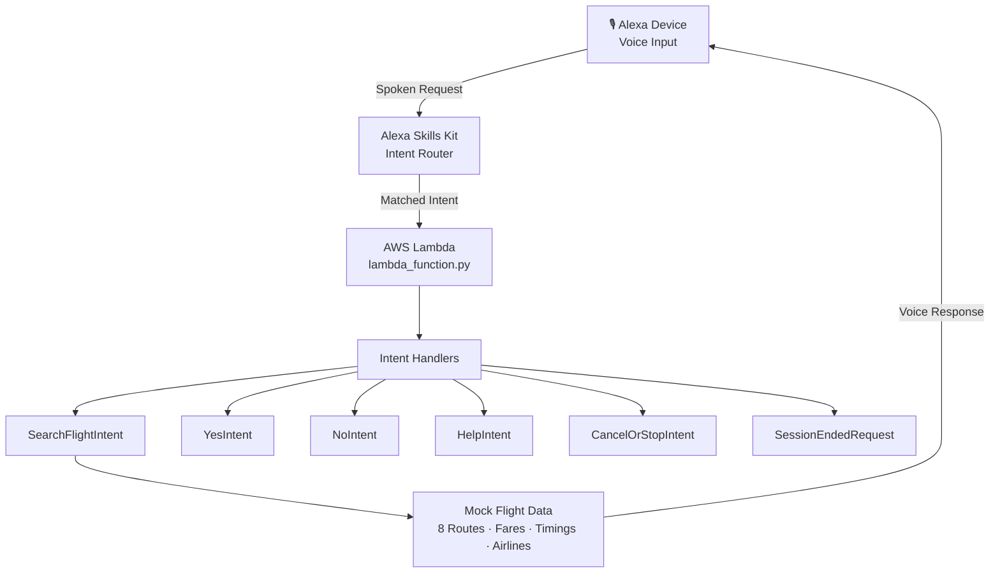

# ✈️ Flight Booker — Alexa Skill

> *"From working inside Alexa AI and AWS to building on top of them — same platforms, a whole new lens."*

A serverless, voice-activated flight search skill built with **Amazon Alexa + AWS Lambda (Python 3.12)**.  
Just say the word — Alexa finds your flight.

---

## 🎙️ How It Works
User: "Alexa, open flight booker"
Alexa: "Welcome to Flight Booker! Where would you like to fly from and to?"

User: "Find me a flight from Delhi to Dubai on June 20th"
Alexa: "I found a flight from Delhi to Dubai on June 20th at 14:30 for ₹8,200. Shall I search another flight?"

---

## 🏗️ Architecture



---

## 🛫 Supported Routes

| Origin        | Destination   | Airlines         |
|---------------|---------------|------------------|
| Delhi         | Mumbai        | IndiGo, Air India|
| Mumbai        | Bangalore     | SpiceJet, IndiGo |
| Delhi         | Dubai         | Emirates, Air India|
| Bangalore     | Chennai       | IndiGo, GoAir    |
| Kolkata       | Delhi         | Air India, IndiGo|
| Mumbai        | Hyderabad     | SpiceJet, IndiGo |
| Delhi         | Singapore     | Singapore Air    |
| Mumbai        | London        | British Airways  |

---

## 🧠 Intent Design

| Intent | Utterance Example | Description |
|---|---|---|
| `SearchFlightIntent` | "Find a flight from Delhi to Dubai on June 20th" | Core flight search |
| `AMAZON.YesIntent` | "Yes" | Search another flight |
| `AMAZON.NoIntent` | "No" | Graceful exit prompt |
| `AMAZON.HelpIntent` | "Help" | Usage instructions |
| `AMAZON.StopIntent` | "Stop / Cancel" | Exit the skill |
| `SessionEndedRequest` | *(auto)* | Clean session teardown |

---

## ⚙️ Tech Stack

| Layer | Technology |
|---|---|
| Voice Interface | Amazon Alexa Skills Kit |
| Backend Runtime | AWS Lambda (Python 3.12) |
| SDK | `ask-sdk-core` |
| Deployment | AWS Console (ZIP upload) |
| Version Control | Git + GitHub |

---

## 🚀 Setup & Deployment

1. Clone this repo
   ```bash
   git clone https://github.com/kkaustav/flight-booker-alexa-skill.git
   ```

2. Zip and upload `lambda_function.py` to AWS Lambda

3. Set handler to `lambda_function.lambda_handler`

4. Link your Alexa Skill to this Lambda ARN in the Alexa Developer Console

5. Test via Alexa Simulator or a real Alexa device

---

## 🗺️ Roadmap

- [ ] Integrate real flight API (Amadeus / Skyscanner)
- [ ] Add multi-city search support
- [ ] Booking confirmation flow
- [ ] DynamoDB session persistence
- [ ] APL visual cards for Echo Show

---

## 👤 Author

**Kaustubh Kar** — AWS Certified Cloud & AI Professional  
9+ years at Amazon across Alexa AI and AWS  
[](https://www.linkedin.com/in/kaustubhkar)
[](https://github.com/kkaustav)
