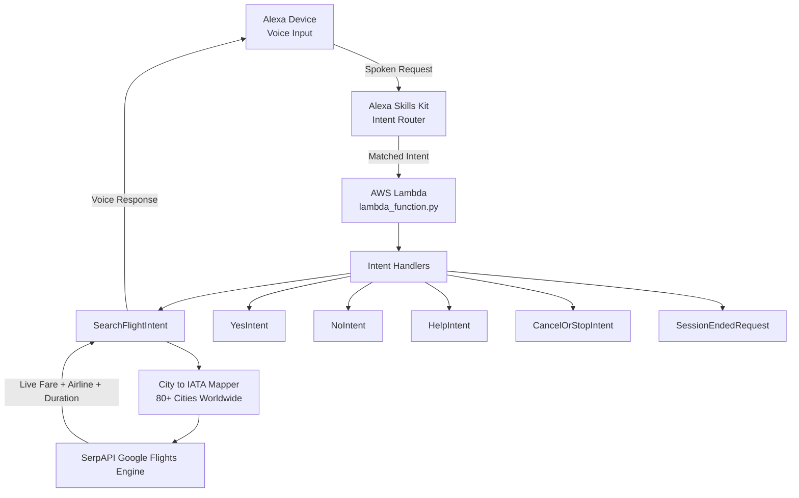

cat > ~/flight_booker/README.md << 'MDEOF'
# ✈️ Flight Booker — Alexa Skill

> *"From working inside Alexa AI and AWS to building on top of them — same platforms, a whole new lens."*

A serverless, voice-activated **live flight search** skill built with **Amazon Alexa + AWS Lambda (Python 3.12)** + **SerpAPI Google Flights**.
Just say the word — Alexa finds your flight, live, in real time.

---

## 🎙️ How It Works

    User:  "Alexa, open flight booker"
    Alexa: "Welcome to Flight Search! Say: find me a flight from Kolkata to London on June twentieth."

    User:  "Find me a flight from Delhi to Dubai on June twentieth"
    Alexa: "I found an Emirates flight from Delhi to Dubai on 2026-06-20,
            taking 3 hours 30 minutes, for 18,450 Indian Rupees."

---

## 🏗️ Architecture

---

## 🌍 Supported Cities (80+)

| Region | Cities |
|--------|--------|
| India | Delhi, Mumbai, Kolkata, Bangalore, Chennai, Hyderabad, Ahmedabad, Pune, Goa, Kochi, Jaipur, Lucknow, Patna, Varanasi, Nagpur, Srinagar, Amritsar, Chandigarh, Visakhapatnam, Trivandrum, Guwahati |
| Middle East | Dubai, Abu Dhabi, Doha, Riyadh, Muscat, Kuwait, Jeddah, Bahrain |
| Europe | London, Paris, Frankfurt, Amsterdam, Rome, Madrid, Zurich, Vienna, Istanbul, Milan, Munich, Barcelona |
| Asia Pacific | Singapore, Bangkok, Hong Kong, Tokyo, Osaka, Seoul, Beijing, Shanghai, Kuala Lumpur, Jakarta, Manila, Colombo, Kathmandu, Dhaka, Sydney, Melbourne |
| Americas | New York, Los Angeles, Chicago, Toronto, San Francisco, Miami, Vancouver, Dallas, Houston, Seattle |
| Africa | Nairobi, Johannesburg, Cairo, Lagos, Cape Town |

---

## 🧠 Intent Design

| Intent | Utterance Example | Description |
|--------|------------------|-------------|
| SearchFlightIntent | "Find a flight from Delhi to Dubai on June twentieth" | Live flight search via SerpAPI |
| AMAZON.YesIntent | "Yes" | Search another flight |
| AMAZON.NoIntent | "No" | Graceful exit prompt |
| AMAZON.HelpIntent | "Help" | Usage instructions |
| AMAZON.StopIntent | "Stop / Cancel" | Exit the skill |
| SessionEndedRequest | (auto) | Clean session teardown |

---

## ⚙️ Tech Stack

| Layer | Technology |
|-------|------------|
| Voice Interface | Amazon Alexa Skills Kit |
| Backend Runtime | AWS Lambda (Python 3.12) |
| SDK | ask-sdk-core v1.19.0 |
| Live Flight Data | SerpAPI - Google Flights Engine |
| HTTP Client | requests v2.33.1 |
| Deployment | AWS Console (ZIP upload) |
| Version Control | Git + GitHub |

---

## 🚀 Setup and Deployment

### 1. Clone this repo

    git clone https://github.com/kkaustav/flight-booker-alexa-skill.git
    cd flight-booker-alexa-skill

### 2. Install dependencies locally

    pip install requests ask-sdk-core ask-sdk-model ask-sdk-runtime python-dateutil -t .

### 3. Package the ZIP

    zip -j flight_booker.zip lambda_function.py
    zip -r flight_booker.zip requests certifi charset_normalizer urllib3 idna six.py ask_sdk_core ask_sdk_model ask_sdk_runtime dateutil

Note: lambda_function.py must be at the root of the ZIP. Verify with: unzip -l flight_booker.zip | head -3

### 4. Deploy to AWS Lambda

1. Go to AWS Lambda and create a function named FlightBookerSkill with Python 3.12
2. Upload the ZIP via Code > Upload from > .zip file > Deploy
3. Set timeout to 15 seconds under Configuration > General configuration
4. Add environment variable: SERP_API_KEY = your key from serpapi.com

### 5. Configure Alexa Skill

1. Go to Alexa Developer Console and create a custom skill named Flight Booker
2. Add SearchFlightIntent with slots: origin, destination, date
3. Add sample utterances like "find me a flight from {origin} to {destination} on {date}"
4. Set endpoint to your Lambda ARN
5. Add Alexa Skills Kit trigger in Lambda with your Skill ID
6. Build and Test

---

## 🔑 Environment Variables

| Variable | Description |
|----------|-------------|
| SERP_API_KEY | Your SerpAPI key from serpapi.com |

---

## 🗺️ Roadmap

- [x] Live flight API via SerpAPI Google Flights
- [x] 80+ cities worldwide
- [x] Flight duration in response
- [ ] Multi-city and return trip search
- [ ] Booking confirmation flow
- [ ] DynamoDB session persistence
- [ ] APL visual cards for Echo Show
- [ ] Price alerts via SNS

---

## 🐛 Troubleshooting

| Error | Cause | Fix |
|-------|-------|-----|
| No module named ask_sdk_core | SDK not bundled | Re-package ZIP with ask_sdk_core, ask_sdk_model, ask_sdk_runtime |
| No module named requests | requests not bundled | Re-package ZIP including requests folder |
| Runtime.ImportModuleError | lambda_function.py in subfolder | Use zip -j to flatten path |
| No flights found | Missing type=2 param | Ensure type 2 (one-way) in SerpAPI params |
| Timeout error | Default Lambda timeout too short | Set Lambda timeout to 15-29 seconds |

---

## 👤 Author

**Kaustubh Kar** — AWS Certified Cloud and AI Professional
9+ years at Amazon across Alexa AI and AWS

MDEOF
echo "Done: $(wc -l < ~/flight_booker/README.md) lines"
